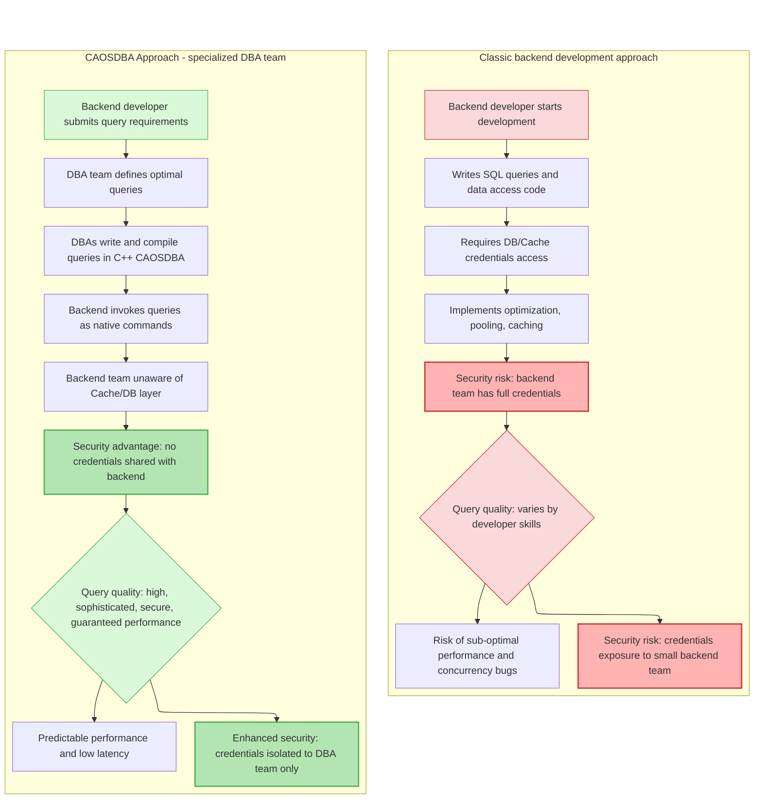

<div>


<p><b>Cache App On Steroids for Database Administrators - High-Performance C++ backend with built-in caching</b></p>
</div>

&nbsp;

# Why CAOSDBA?

**CAOSDBA** is a high-performance C++ framework designed with a **cache-first architecture** at its core. It's particularly valuable for teams seeking **predictable low-latency** and **scalable data access patterns**.

By integrating [**CrowCpp**](https://github.com/CrowCpp/Crow) as its backend engine for REST APIs or exposing C++ queries as **native PHP/Python/Node.js extensions**, allowing teams to execute high-performance C++ code through a simple PHP/Python/Node.js function calls.

**In essence**, CAOSDBA bridges the gap between application code and data layer optimization, making expert-level query performance accessible across your entire tech stack.

&nbsp;

# Collaborative data layer design

**Great applications are built on great data layers**—but creating optimal data access patterns requires bridging multiple areas of expertise. DBAs bring deep knowledge of query optimization and data modeling, while developers focus on application logic.

CAOSDBA helps these different experts work together effectively, ensuring that database expertise translates directly into application performance without creating silos or complexity.

## **How CAOSDBA enables team collaboration**

- **DBAs write optimized queries** in C++ with full control over execution plans and caching strategies
- **Developers access data** through native PHP/Python/Node.js functions or REST APIs
- **Performance knowledge stays with experts** who understand the data layer best
- **Application code remains clean** and focused on business logic
- **Teams share ownership** of data layer performance and scalability

## **Traditional challenges vs. CAOSDBA approach**

**Traditional approach:**
```text
FUNCTION FetchData(RequestParameters):
    // 1. Check Cache Layer
    Result = Cache.Search(RequestParameters)
    
    IF Result is FOUND:
        LOG "Cache Hit"
        RETURN Result
    
    // 2. Database Fallback (Cache Miss)
    LOG "Cache Miss - Executing Database Query"
    Result = Database.Execute(RequestParameters)
    
    IF Result EXISTS:
        // 3. Populate Cache for subsequent requests
        Cache.Save(RequestParameters, Result, TTL)
        RETURN Result
        
    RETURN Error.NotFound
```

&nbsp;

**With CAOSDBA:**
```text
// CAOSDBA: Declaration-Driven Data Access

// 1. The framework provides a clean, typed interface
Function GetUser(CallContext, ID):
    // Internal logic (Hidden from developer):
    // - Validates API Token via Environment Variables
    // - Checks Cache Layer automatically
    // - Executes optimized C++ Query on Miss
    // - Updates Cache
    Return CAOSDBA_Generated_Service.Execute(CallContext, ID)

// 2. High-level Application Usage
Result = GetUser(CallContext, TargetID)

IF Result.IsDefined:
    ProceedWithBusinessLogic(Result.Value)
```

&nbsp;

| Aspect | Traditional Approach | With CAOSDBA |
| :--- | :--- | :--- |
| **Query Ownership** | Scattered across application code | Centralized with data experts |
| **Performance Consistency** | Varies by developer experience | Guaranteed by DB experts |
| **Team Collaboration** | Often reactive and siloed | Proactive and integrated |
| **Caching Strategy** | Application-focused implementation | Data-layer focused with DBA guidance |

&nbsp;

# Performance by Architectural Design

&nbsp;

## **Data access & caching:**
* **Cache-First architecture:** Every critical request is directed to **Redis** first, ensuring **sub-millisecond response times**
* **Smart caching:** Configurable **cache invalidation strategies** and distributed caching support to guarantee data freshness and consistency
* **Unified access:** A consistent and **automated API** for interacting with all persistence layers

## **Connection infrastructure (Pool Management):**
* **Automatic connection pooling:** The framework intelligently manages a **pool of connections** (to Redis and databases) to avoid resource saturation and the overhead of connection creation/destruction
* **Controlled scalability:** Allows configuration of **minimum and maximum** connection limits, enabling CAOSDBA to optimize resource utilization elastically

## **Multi-Database support:**
* **PostgreSQL:** Full ACID compliance for critical data
* **MySQL/MariaDB:** Reliable, enterprise-grade relational storage
* **Redis:** Blazing-fast in-memory caching layer

## **Web & API ready:**
* **Built-in HTTP server** via **CrowCpp** for rapid service development
* Out-of-the-box **REST API** endpoints, ideal for **microservices** and **API Gateways**
* **Native PHP/Python/Node.js exports** - call C++ queries directly as PHP/Python/Node.js functions

&nbsp;

# Architecture & Technology

## **Architectural benefits:**
* **Reduced Database Load:** Smart caching can **cut direct DB queries by up to 90%**
* **Improved Data Consistency:** Robust invalidation and synchronization mechanisms
* **Developer Productivity:** Consistent and reusable data layer patterns
* **Flexible Deployment:** Supports single instances and distributed clusters


## Overview



&nbsp;

# Ideal For

* **High-Traffic web applications:** Efficient handling of thousands of concurrent users
* **Near Real-Time data processing:** **Low-latency** data ingestion and processing
* **Microservices ecosystems:** Incredibly fast inter-service communication
* **API Gateways:** Accelerating API responses and offloading DB load
* **E-commerce/Gaming:** High-performance product catalogs and leaderboards
* **Data-Intensive backends:** Services requiring efficient processing of large datasets like ERP, WMS or CRM

&nbsp;

# Supported Technologies:

| Category | Technologies |
| :--- | :--- |
| **Persistence** | PostgreSQL, MySQL, MariaDB |
| **Caching** | Redis |
| **Web/REST** | CrowCpp (HTTP/JSON) - PHP/Python/Node.js native extension |
| **Language** | C++17+ |
| **Platform** | Linux |
| **Build System** | CMake |

&nbsp;

# Prerequisites

- C++17 or later
- CMake 3.15+
- Linux OS
- PHP 8.0+ (for PHP bindings)
- Python 3.6+ (for Python bindings)
- Node.js 14+ (for Node.js bindings)

&nbsp;

# Getting Started

**Install dependencies (Debian/Ubuntu):**

```bash
sudo apt-get update
sudo apt-get install libfmt-dev libspdlog-dev libhiredis-dev

# For MySQL support
sudo apt-get install libmysqlclient-dev libmysqlcppconn-dev

# For MariaDB support
sudo apt-get install libmariadb-dev

# PHP bindings
sudo apt-get install php-dev

# Python bindings
sudo apt-get install python3-dev

# Node.js bindings
sudo apt-get install libnode-dev node-gyp
```

**Clone repository from GitHub with submodules:**

```bash
git clone --recurse-submodules https://github.com/mydevhero/CAOSDBA.git

# Change to project directory
cd CAOSDBA
```

&nbsp;

# Configure project

Currently CAOSDBA provides support for PHP, Python and Node.js language bindings or CrowCpp backend.

&nbsp;

## Project type
The flag `CAOS_PROJECT_TYPE` defines which kind of project to create.

&nbsp;

## Language binding
- `CAOS_PROJECT_TYPE=BINDING`

If you choose `BINDING` as `CAOS_PROJECT_TYPE`, then you have to choose which language to bind to using the `CAOS_BINDING_LANGUAGE` flag:
- `CAOS_BINDING_LANGUAGE=PHP`
- `CAOS_BINDING_LANGUAGE=PYTHON`
- `CAOS_BINDING_LANGUAGE=NODEJS`

&nbsp;

## CrowCpp
- `CAOS_PROJECT_TYPE=CROWCPP`

If you choose `CAOS_PROJECT_TYPE=CROWCPP`, then you have to choose which kind of support you want by defining the `CAOS_CROWCPP_TYPE` flag:
- `CAOS_CROWCPP_TYPE=ENDPOINT` 
- `CAOS_CROWCPP_TYPE=MIDDLEWARE`

&nbsp;

## Database
The flag `CAOS_DB_BACKEND` can be set to one of the three databases currently supported:
- `CAOS_DB_BACKEND=MARIADB`
- `CAOS_DB_BACKEND=MYSQL`
- `CAOS_DB_BACKEND=POSTGRESQL` 

&nbsp;

# Examples

&nbsp;

## PHP binding with MySQL backend

```bash
cmake -G Ninja -DCAOS_DB_BACKEND=MYSQL -DCAOS_PROJECT_TYPE=BINDING -DCAOS_BINDING_LANGUAGE=PHP ../../
```

## Python binding with MySQL backend

```bash
cmake -G Ninja -DCAOS_DB_BACKEND=MYSQL -DCAOS_PROJECT_TYPE=BINDING -DCAOS_BINDING_LANGUAGE=PYTHON ../../
```

## Node.js binding with MySQL backend

```bash
cmake -G Ninja -DCAOS_DB_BACKEND=MYSQL -DCAOS_PROJECT_TYPE=BINDING -DCAOS_BINDING_LANGUAGE=NODEJS ../../
```

### CrowCpp backend on PostgreSQL
```bash
cmake -G Ninja -DCAOS_DB_BACKEND=POSTGRESQL -DCAOS_PROJECT_TYPE=CROWCPP -DCAOS_CROWCPP_TYPE=MIDDLEWARE ../../
```

&nbsp;

# Defining queries

CAOSDBA uses YAML files with JSON Schema validation to define queries. This provides better structure, validation, and extensibility compared to the previous TXT format.

Look into queries.yaml for query definitions. For detailed documentation on the YAML format and JSON Schema validation, see the [**Query Definitions Guide**](https://github.com/mydevhero/CAOSDBA/wiki/Query-Definitions-Guide) in the wiki.

## Quick example:

```yaml
queries:
  # Echo
  - name: IQuery_Template_echoString_custom
    enabled: true
    metadata:
      category: template
    return_type: std::optional<std::string>
    description: "Echo a string back"

    parameters:
      - type: std::string
        name: str
        description: "Input string to echo"

    authentication:
      type: TOKEN
      required: true
      env_var: CAOS_API_TOKEN
      validation:
        min_length: 32
        max_length: 64

    tags: [template]
```

## Key features

- YAML format - Human-readable, structured definition
- JSON Schema validation - Automatic validation of query definitions

&nbsp;

# Build
```bash
cmake --build .
```

&nbsp;

# Environment variables used by CAOS

CAOSDBA requires these environment variables to be set before running:

### Redis

```bash
export CAOS_CACHEHOST="localhost"
export CAOS_CACHEPORT=6379
export CAOS_CACHEPASS=""
```

### Database

```bash
export CAOS_DBHOST="localhost"
export CAOS_DBPORT=3306 # 5432
export CAOS_DBUSER="..."
export CAOS_DBPASS="..."
export CAOS_DBNAME="..."
```

### TOKENs

Export each TOKEN as defined in `queries.yaml`:

```bash
export CAOS_API_TOKEN=ARBJi7cJuOYPXmFPPLVWsGrXmD4SU3LW
```

&nbsp;

# First try

NOTE: library is called "my_app", like the PROJECT_NAME in CMakeLists.txt

## PHP

```bash
php -d extension=./my_app.so -r 'print_r(IQuery_Template_echoString(["token" => "ARBJi7cJuOYPXmFPPLVWsGrXmD4SU3LW"], "Hello CAOSDBA!"));'
```


## Python

```bash
python3 -c 'import my_app; print(my_app.IQuery_Template_echoString({"token":"ARBJi7cJuOYPXmFPPLVWsGrXmD4SU3LW"}, "Hello CAOSDBA!"));'
```


## Node.js

```bash
node -e 'const caos = require("./node_${VERSION}/my_app");const result = caos.IQuery_Template_echoString({"token":"ARBJi7cJuOYPXmFPPLVWsGrXmD4SU3LW"}, "Hello CAOSDBA\!");console.log(result);'
```

### Test with Typescript

```bash
npm install -g typescript

cd typescript/test

tsc

node test.js
```

&nbsp;

# Prepare to release your CAOSDBA app

```bash
sudo cmake --build . --target make_distribution_tarball
```

&nbsp;

## Multiple Projects Support

This system supports multiple CAOSDBA-based projects installed simultaneously on the same system. Each project has its own isolated repository:

```text
/opt/caosdba/
├── repositories/
│ ├── my_app/ # First project repository
│ ├── my_app2/ # Second project repository
│ └── another_app/ # Third project repository
└── install-repository.sh
```

### Deb package features:

- **Isolated repositories**: Each project maintains its own APT repository
- **No conflicts**: Projects don't interfere with each other
- **Parallel installation**: Install multiple projects side-by-side
- **Independent updates**: Update each project independently

### How It Works:

1. **Project-specific paths**: Each project's repository is stored in `/opt/caosdba/repositories/<project_name>/`
2. **APT source isolation**: Each project configures its own APT source file
3. **Package namespacing**: Packages include the project name (e.g., `my_app-python-postgresql-3.12`)

### Installation workflow:

```bash
cd build/release

# Install first project
sudo tar -xzf my_app-python-deb-repository-postgresql-1.0.0+1.tar.gz -C /
sudo /opt/caosdba/install-repository.sh

# Both projects are now available via APT
sudo apt install my-app-python-postgresql
```

# Try global module

NOTE: library is called "my_app", like the PROJECT_NAME in CMakeLists.txt

```bash
# PHP
php -r 'print_r(IQuery_Template_echoString(["token" => "ARBJi7cJuOYPXmFPPLVWsGrXmD4SU3LW"], "Hello CAOSDBA!"));'

# Python
python3 -c 'import my_app; print(my_app.IQuery_Template_echoString({"token":"ARBJi7cJuOYPXmFPPLVWsGrXmD4SU3LW"}, "Hello CAOSDBA!"));'

# Node.js
node -e 'const caos = require("my_app");const result = caos.IQuery_Template_echoString({"token":"ARBJi7cJuOYPXmFPPLVWsGrXmD4SU3LW"}, "Hello CAOSDBA!");console.log(result);'
```

&nbsp;

# Clean project

During the initial CMake configuration, CAOS sets up the project by copying and creating necessary files. If you need to start from scratch (e.g., after major configuration changes or to resolve build issues), you can clean the project using the following steps.

&nbsp;

## ⚠️ Warning

The purge operation **deletes files irreversibly**, including:
- The `build/release` directory
- Configuration files in `cmake/`
- The entire `src/` directory

Make sure you have committed or backed up any important changes before proceeding.

&nbsp;

## Cleanup commands

```bash
# Remove the build directory
rm -rf build/release

# Purge generated configuration files (deletes files in cmake/ and src/!)
./bin/caosdba.sh --purge
```

&nbsp;

## What happens after cleaning

After running these commands, you'll need to:

- Re-run CMake configuration
- Rebuild the project from scratch

&nbsp;

# Documentation

For detailed documentation on specific topics, refer to the CAOSDBA wiki:

- 📖 [**Query Definitions Guide**](https://github.com/mydevhero/CAOSDBA/wiki/Query-Definitions-Guide) - Complete YAML format reference with examples
- 🔧 [**JSON Schema Reference**](https://github.com/mydevhero/CAOSDBA/wiki/JSON-Schema-Reference) - Schema validation and field definitions

&nbsp;

# Contributing

Contributions are welcome! Please feel free to submit a Pull Request.

&nbsp;

# Show your support

If you find CAOSDBA useful, please consider giving it a star on GitHub!
